# APP SHOESTORE
Shoestore is a modern mobile application designed for shoe enthusiasts and fashion-forward individuals. Discover a wide range of stylish footwear from top brands, all in one place. Whether you're looking for the latest trends, timeless classics, or exclusive releases, Shoestore has something for everyone. With an intuitive interface, users can easily browse collections, filter by size, color, or brand, and make secure purchases with just a few taps. Stay updated with personalized recommendations and special offers tailored to your preferences. Experience the convenience of shopping for your favorite shoes anytime, anywhere with Shoestore.


## Authors
- [Quan Văn Mạnh](https://github.com/Manh-IT-K2)

## Project Description:
Meditation application is built with functions including register/login, change password, forgot password, log in with facebook/google, listen to meditation music, edit personal information, change language,...
## Tech Stack Used:
```bash
  #FrondEnd
    * Kotlin(jetpack compose)
  #BackEnd
    * Spring Boot
    * MongoDB
```
## Main features of the application:
```bash
1. Register:
    - User fills in information: username, email, password.
2. Login:
    - Enter your email and password to login to the application.
```
## Project Demo UI
Youtobe: https://youtu.be/MMnGS0LbO4I?si=JMyB04lhjZAvtDTj
## Application interface:

| Introduce1 | Introduce2 | Introduce3 | Home |
|:----------:|:----------:|:----------:|:----:|
| 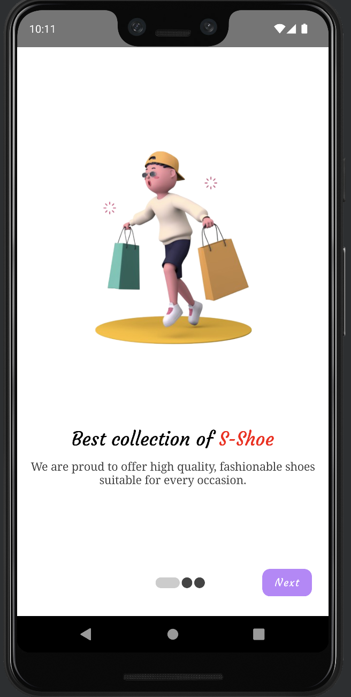 | 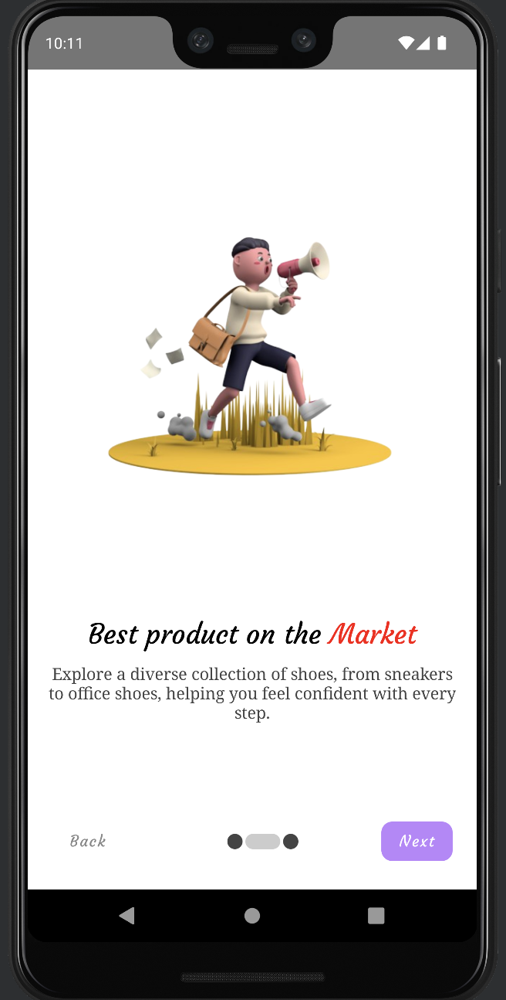 | 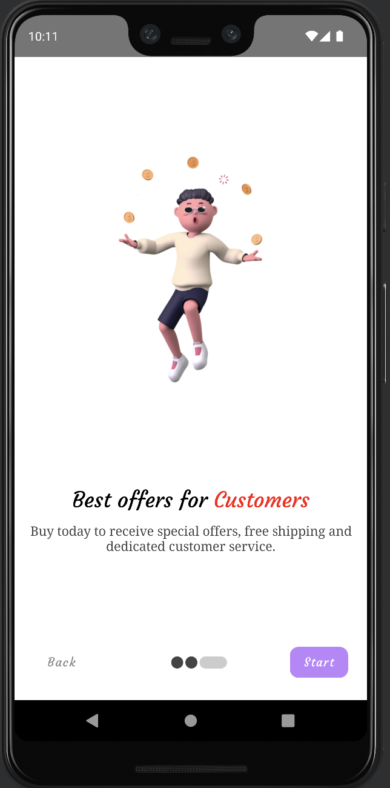 | 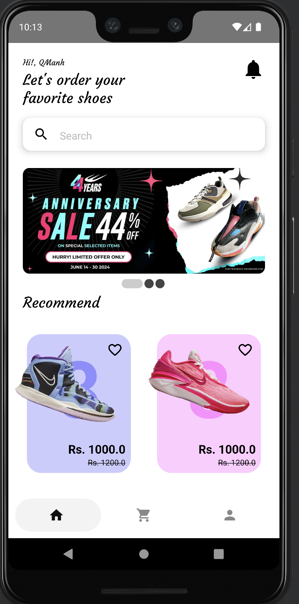 |

| Login | Signup | Detail Product | Notification |
|:-----:|:------:|:--------------:|:------------:|
| 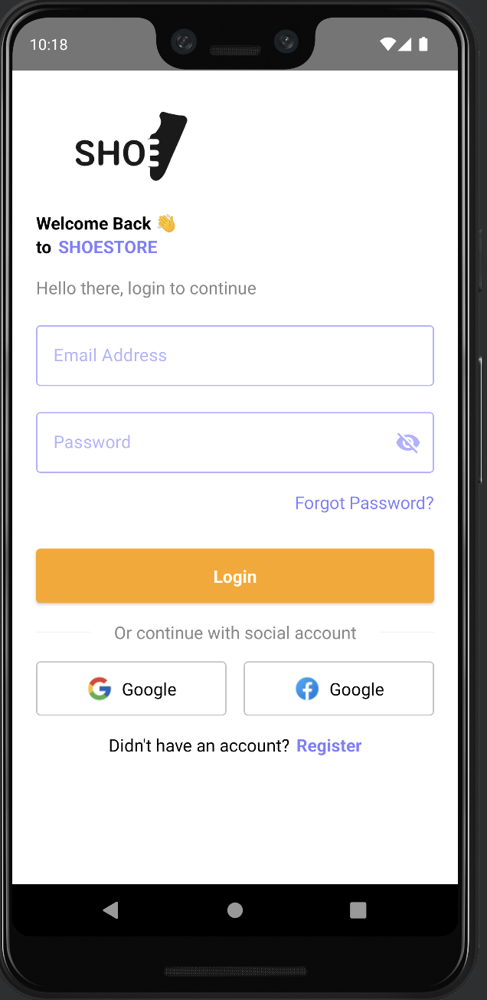 | 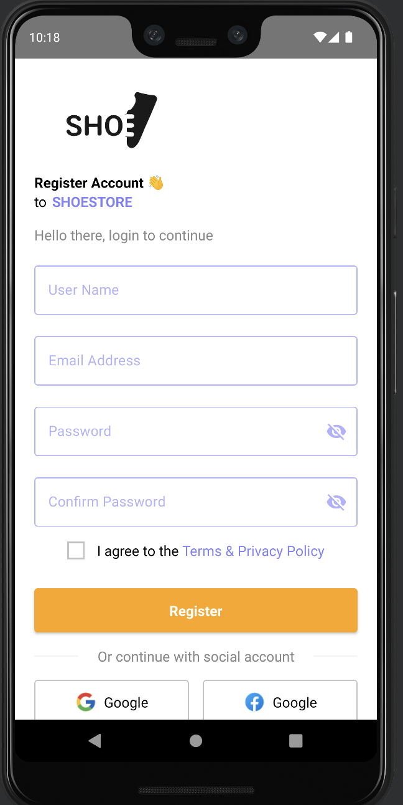 | 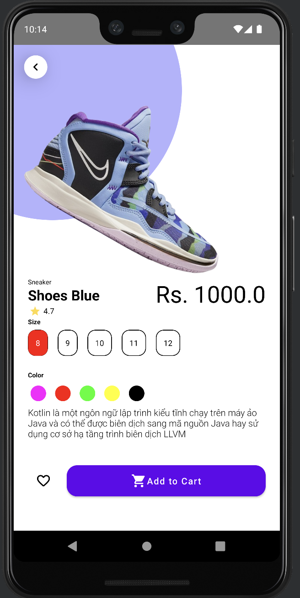 | 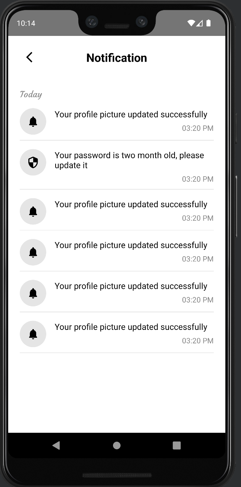 |

| Forgot Password | OTP Screen | New Password | Congratulation |
|:-----------:|:----------:|:---------------:|:------------:|
| 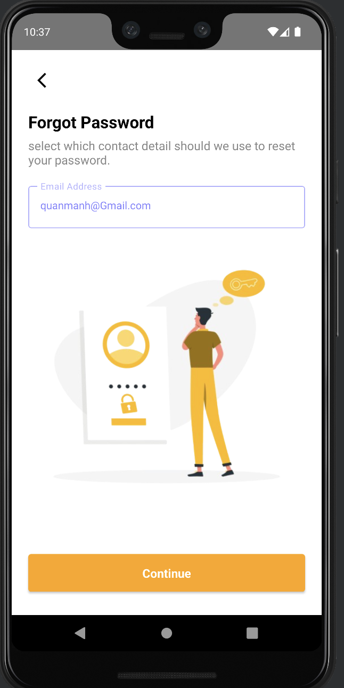 | 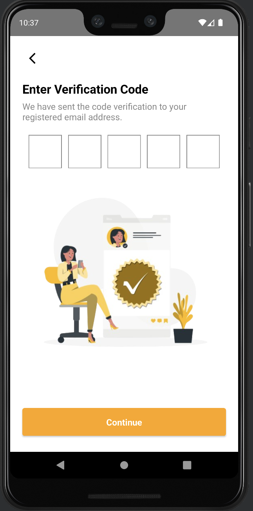 | 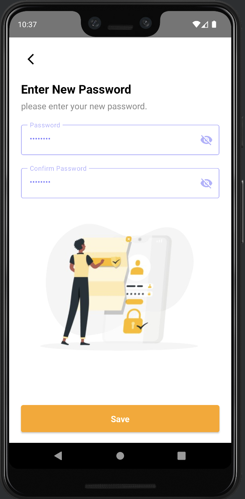 | 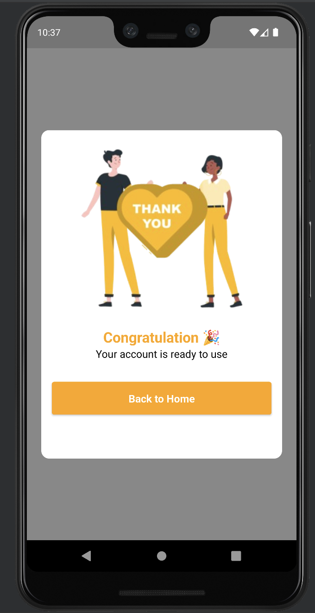 |

| Setting | Be Premium | My Favourite | My Offline |
|:-------:|:----------:|:------------:|:----------:|
|  |  |  |  |

| Edit Profile | Edit Avatar | Chose Time Alarm | Alarm |
|:------------:|:-----------:|:---------------:|:------:|
|  |  |  |  |

| Chose Topic | Time Notify Turn App | Podcast English | Music Relaxation |
|:-----------:|:--------------------:|:---------------:|:----------------:|
|  |  |  |  |

| Change Password Use Forgot| Change Password | Veryfi Code | Change Language |
|:-------------------------:|:---------------:|:-----------:|:---------------:|
|  |  |  |  |

| Forgot Password | Fogot Password Use Email | Fogot Password Use Phone | Fogot Password Use Username |
|:---------------:|:------------------------:|:------------------------:|:---------------------------:|
|  |  |  |  |


### Make sure to star the repository if you find it helpful!
<a href="https://github.com/Manh-IT-K2/AppShoeStore/stargazers"></a>

