# APP SHOESTORE
Shoestore is a modern mobile application designed for shoe enthusiasts and fashion-forward individuals. Discover a wide range of stylish footwear from top brands, all in one place. Whether you're looking for the latest trends, timeless classics, or exclusive releases, Shoestore has something for everyone. With an intuitive interface, users can easily browse collections, filter by size, color, or brand, and make secure purchases with just a few taps. Stay updated with personalized recommendations and special offers tailored to your preferences. Experience the convenience of shopping for your favorite shoes anytime, anywhere with Shoestore.


## Authors
- [Quan Văn Mạnh](https://github.com/Manh-IT-K2)

## Project Description:
Meditation application is built with functions including register/login, change password, forgot password, log in with facebook/google,... Developing
## Tech Stack Used:
```bash
  FrondEnd
    * Kotlin(jetpack compose)
  BackEnd
    * Spring Boot
    * MongoDB
```
## Main features of the application:
```bash
1. Register:
    - User fills in information: username, email, password.
2. Login:
    - Enter your email and password to login to the application.
3. Other functions: Developing
```
## Project Demo UI
Youtobe: https://youtu.be/MMnGS0LbO4I?si=JMyB04lhjZAvtDTj
## Application interface:

| Introduce1 | Introduce2 | Introduce3 | Home |
|:----------:|:----------:|:----------:|:----:|
|  |  |  |  |

| Login | Signup | Detail Product | Notification |
|:-----:|:------:|:--------------:|:------------:|
|  |  |  |  |

| Forgot Password | OTP Screen | New Password | Congratulation |
|:-----------:|:----------:|:---------------:|:------------:|
|  |  |  |  |

| Profile | Favorite | Search | Filter |
|:-------:|:--------:|:------:|:------:|
| 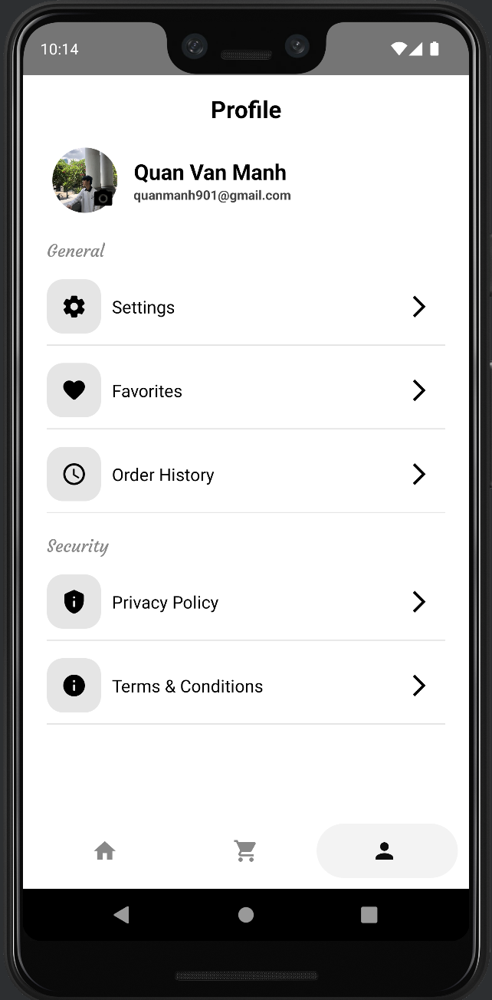 | 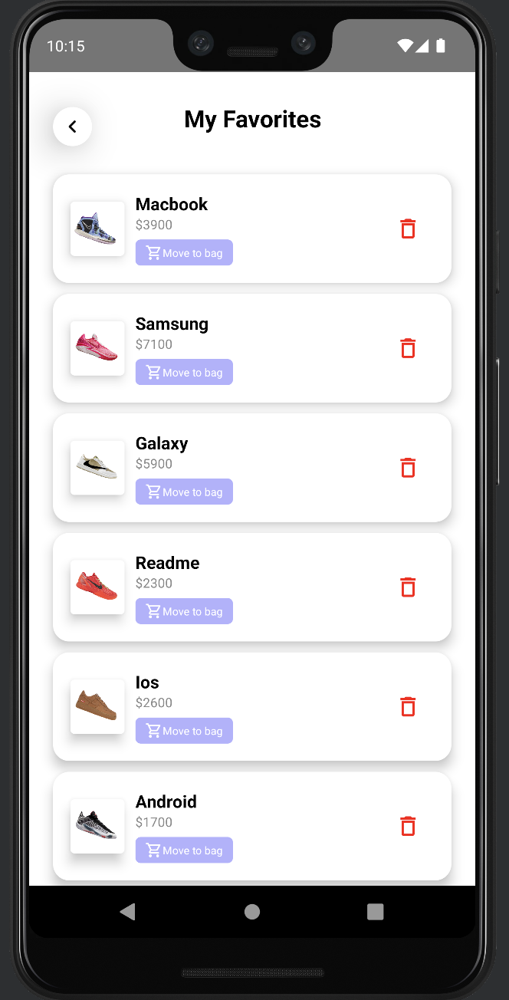 | 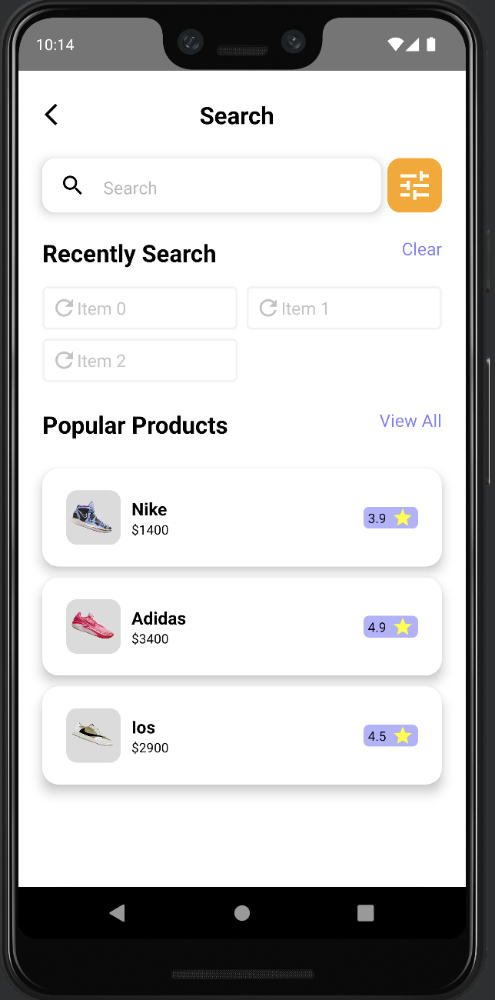 | 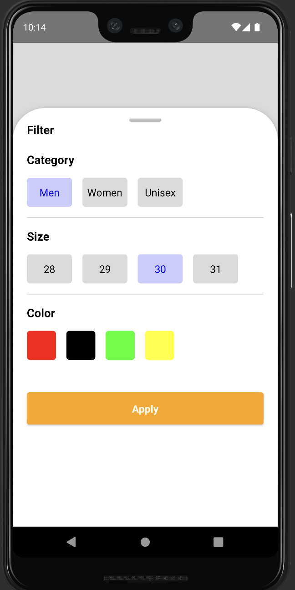 |

| Setting | My Card | Shipping Address | Payment Method |
|:-------:|:-------:|:----------------:|:--------------:|
|  | 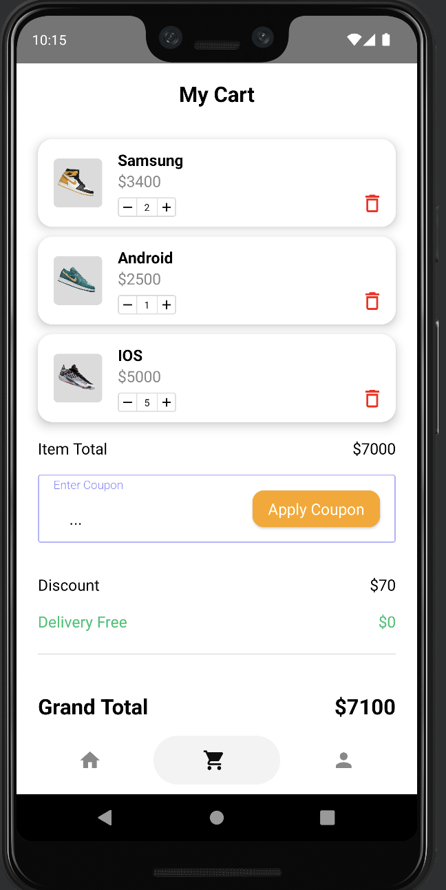 | 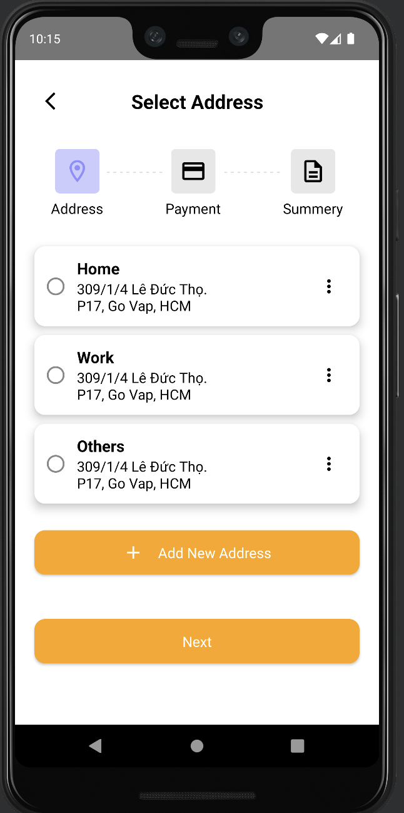 | 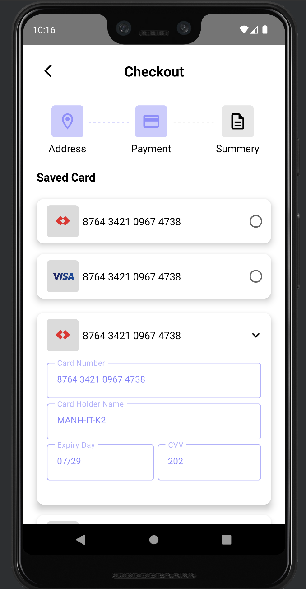 |

| Order Summary | Payment Successfully | Order Details | Full Order Details |
|:-----------:|:--------------------:|:---------------:|:----------------:|
| 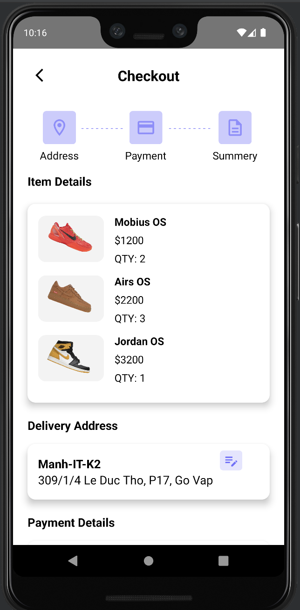 | 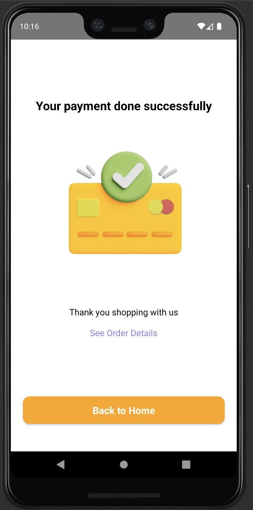 | 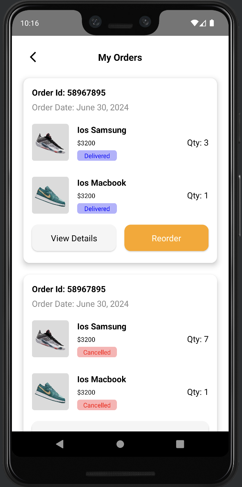 | 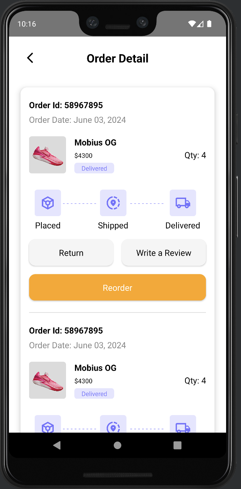 |

| Order Placed Details|
|:-------------------------:|
| 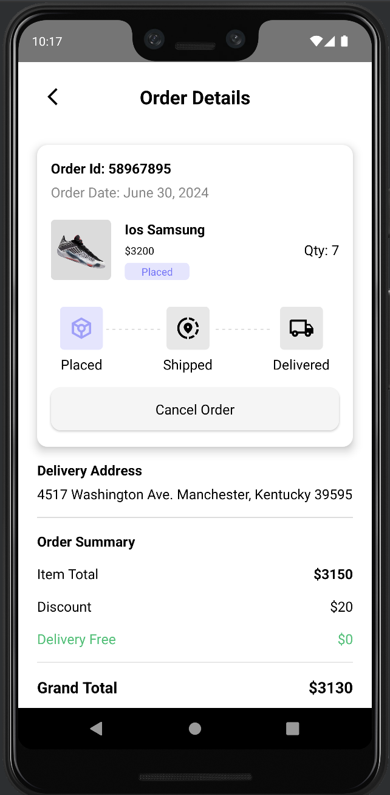 |


### Make sure to star the repository if you find it helpful!
<a href="https://github.com/Manh-IT-K2/AppShoeStore/stargazers"></a>

